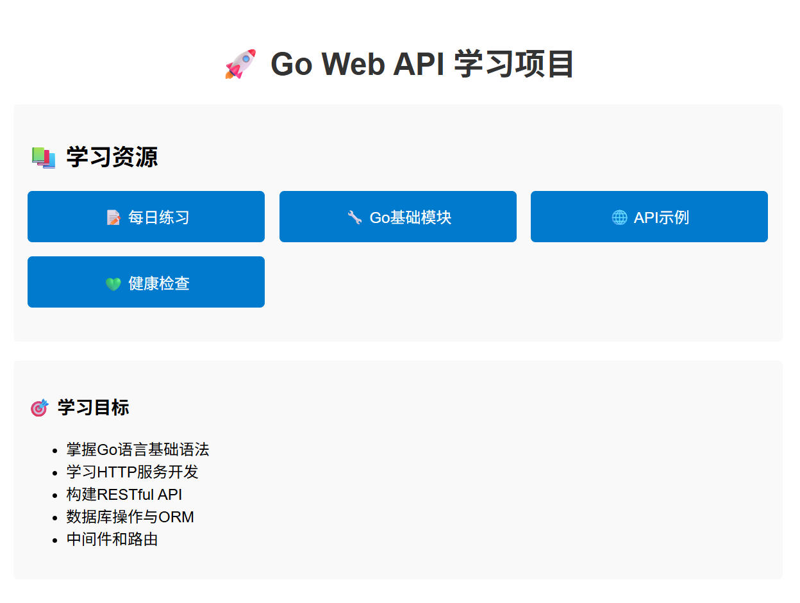
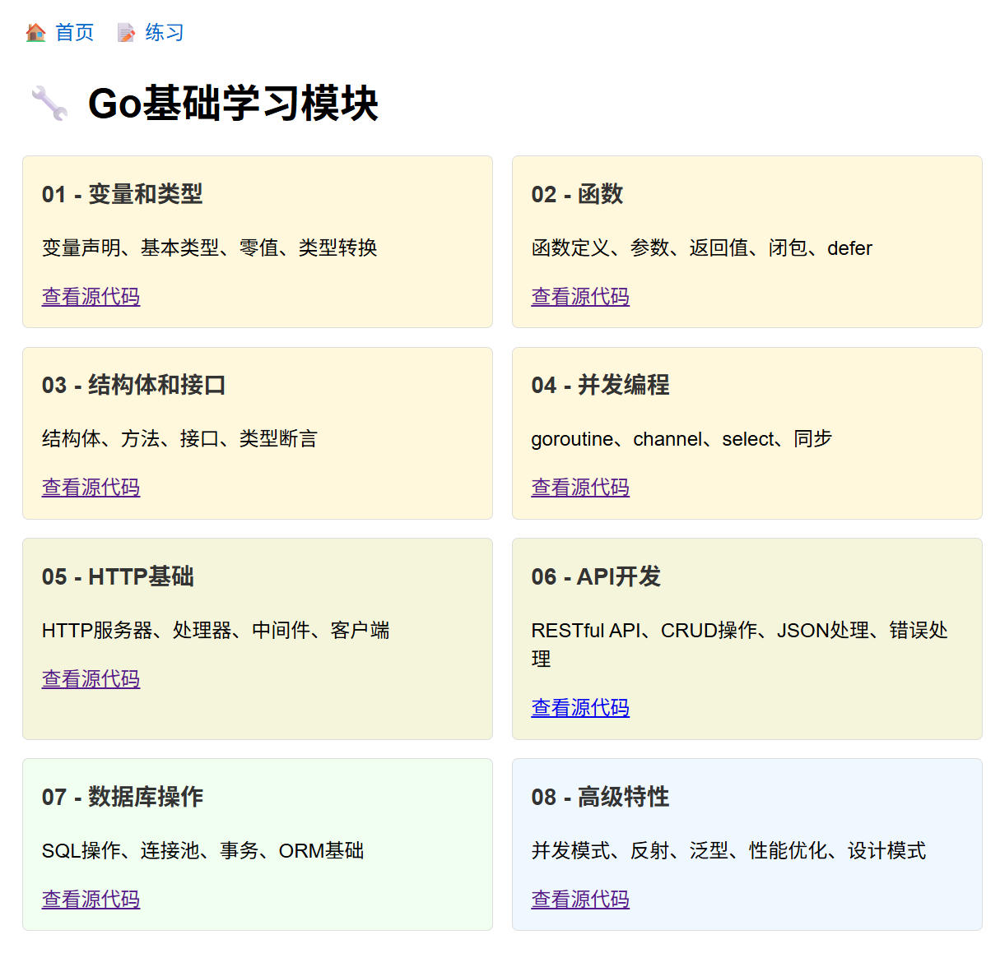

# go-web-api-study

📚 Go 语言 Web 开发与接口开发学习笔记与实践项目集合

> 记录使用 Go (Golang) 进行 Web 开发和 API 接口开发过程中的学习笔记、代码示例、实战项目与最佳实践。

---

## 🌱 项目目标

本仓库旨在系统性地学习和掌握 Go 语言在后端 Web 开发和 RESTful API 开发中的应用，涵盖从基础语法到框架使用、项目结构设计、数据库操作、中间件开发、接口测试等完整技能链。

适合：
- Go 初学者入门 Web 开发
- 想深入理解 Go 后端工程实践的开发者
- 寻找可复用代码示例的学习者

---



## 🚀 快速开始

### 启动学习环境

```bash
# 克隆项目
git clone https://github.com/lookteas/go-web-api-study.git
cd go-web-api-study

# 启动Web学习服务器
go run cmd/api/main.go
# 或者构建后运行
go build -o server.exe cmd/api/main.go
./server.exe
```

### 访问学习界面

启动服务器后，访问以下地址：

- **🏠 主页**: http://localhost:8080
- **📝 每日练习**: http://localhost:8080/exercises ([练习计划详情](./exercises/README.md))
- **🔧 基础模块**: http://localhost:8080/gobase
- **💚 健康检查**: http://localhost:8080/health

---

## 📚 学习内容概览

| 主题 | 内容 | 状态 |
|------|------|------|
| ✅ 基础语法回顾 | 变量、函数、结构体、接口、并发等 | 已完成 |
| ✅ HTTP 服务开发 | 使用 `net/http` 构建基础 Web 服务 | 已完成 |
| ✅ RESTful API 设计 | 请求处理、JSON 序列化、状态码规范 | 已完成 |
| ✅ 数据库操作 | SQL操作、连接池、事务、ORM基础 | 已完成 |
| ✅ 高级特性 | 并发模式、反射、泛型、性能优化、设计模式 | 已完成 |
| ✅ 中间件开发 | 日志、认证、CORS、限流等 | 已完成 |
| ✅ 用户认证 | JWT、Session、OAuth2 基础实现 | 已完成 |
| ✅ 配置管理 | 使用 `Viper` 管理配置文件 | 已完成 |
| ✅ 错误处理 | 统一错误响应结构 | 已完成 |
| ✅ 接口测试 | 使用 `testing` 包进行单元测试与集成测试 | 已完成 |
| ✅ 项目结构设计 | 推荐的 Go 项目分层结构 | 已完成 |
| ✅ 部署实践 | Docker 打包、简单部署流程 | 已完成 |

---



## 📁 项目结构

```bash
.
├── cmd/                   # 主程序入口
│   └── api/
│       └── main.go        # Web服务器主程序
├── docs/                  # 文档目录
│   └── learning_plan.md   # 学习计划文档
├── exercises/             # 每日练习目录
│   ├── README.md          # 6周练习计划
│   ├── day01/             # 第1天练习
│   │   └── hello_world.go
│   ├── day02/             # 第2天练习
│   │   └── hello_world.go
│   └── day03/             # 第3天练习
│       └── ......
├── gobase/                # Go基础学习模块
│   ├── README.md          # 模块说明
│   ├── 01_variables_and_types.go    # 变量和类型
│   ├── 02_functions.go              # 函数
│   ├── 03_structs_and_interfaces.go # 结构体和接口
│   ├── 04_concurrency.go           # 并发编程
│   ├── 05_http_basics.go           # HTTP基础
│   ├── 06_api_development.go       # API开发
│   ├── 07_database_basics.go       # 数据库操作
│   └── 08_advanced_features.go     # 高级特性
├── internal/              # 内部逻辑代码
│   ├── handler/           # HTTP 请求处理器
│   │   └── handler.go
│   ├── middleware/        # 自定义中间件
│   │   ├── cors.go
│   │   └── logger.go
│   ├── model/             # 数据结构与数据库模型
│   │   └── user.go
│   └── service/           # 业务逻辑
│       └── user_service.go
├── go.mod                 # Go模块文件
├── server.exe             # 编译后的可执行文件
└── README.md              # 项目说明文档
```

---

## 🎯 学习路径

### 第一阶段：基础语法 (gobase模块)
1. **变量和类型** - 掌握Go的基本数据类型和变量声明
2. **函数** - 学习函数定义、参数传递、闭包等
3. **结构体和接口** - 理解Go的面向对象编程
4. **并发编程** - 掌握goroutine和channel

### 第二阶段：Web开发 (gobase模块)
5. **HTTP基础** - 学习HTTP服务器开发
6. **API开发** - 构建RESTful API
7. **数据库操作** - 数据持久化和ORM
8. **高级特性** - 性能优化和设计模式

### 第三阶段：实践练习 (exercises目录)
- **6周练习计划** - 每日一练，循序渐进 📋 [详细练习计划](./exercises/README.md)
- **项目实战** - 结合所学知识构建完整项目

#### 📅 练习计划概览
- **第1-2周**: Go语言基础入门和核心概念
- **第3-4周**: HTTP和Web开发、数据库操作
- **第5-6周**: 项目实战和部署优化

> 💡 **提示**: 点击 [练习计划详情](./exercises/README.md) 查看完整的42天学习安排

---

## 🔧 功能特性

### Web学习界面
- 📱 响应式设计，支持多设备访问
- 🎨 美观的UI界面，提升学习体验
- 📝 源代码在线查看，支持语法高亮
- 🔗 便捷的导航链接，快速跳转

### 学习模块
- 📚 **8个基础模块** - 从入门到进阶的完整知识体系
- 💡 **丰富的代码示例** - 每个概念都有实际代码演示
- 📖 **详细的注释说明** - 帮助理解每行代码的作用
- 🛠️ **实用工具函数** - 可直接在项目中使用

### 练习系统
- 📅 **6周学习计划** - 科学安排学习进度 ([查看详细计划](./exercises/README.md))
- 🎯 **循序渐进** - 从简单到复杂，逐步提升
- 💻 **命令行运行** - 支持直接运行练习代码
- 🌐 **Web端查看** - 在浏览器中查看源代码
- 📋 **42天练习** - 每日一练，持续学习

---

## 🤝 贡献指南

欢迎提交 Issue 和 Pull Request 来完善这个学习项目！

### 贡献方式
1. Fork 本仓库
2. 创建你的特性分支 (`git checkout -b feature/AmazingFeature`)
3. 提交你的修改 (`git commit -m 'Add some AmazingFeature'`)
4. 推送到分支 (`git push origin feature/AmazingFeature`)
5. 打开一个 Pull Request

---

## 📄 许可证

本项目采用 MIT 许可证 - 查看 [LICENSE](LICENSE) 文件了解详情

---

## 🙏 致谢

感谢所有为Go语言生态系统做出贡献的开发者们！

---

**Happy Coding! 🚀**
